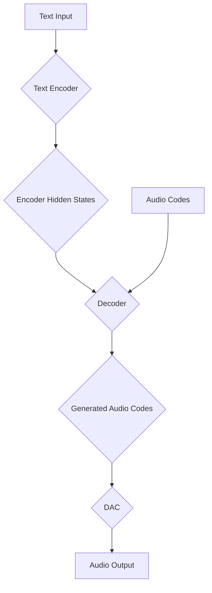

## Parler-TTS Model Architecture

The Parler-TTS model is a sophisticated text-to-speech (TTS) system based on a transformer architecture. It leverages a text encoder, a decoder, and a Digital-to-Analog Converter (DAC) to generate high-quality speech from text inputs. This document provides a detailed explanation of the model's architecture, its components, and their functions.

### Block Diagram

### Components

The Parler-TTS model consists of three main components:

1.  **Text Encoder**: Processes the input text and converts it into a sequence of hidden states.
2.  **Decoder**: Generates audio codes based on the encoder's hidden states and previous audio codes.
3.  **Digital-to-Analog Converter (DAC)**: Converts the generated audio codes into an audio waveform.

Each of these components is explained in detail below.

#### Text Encoder

The text encoder is responsible for understanding the input text and converting it into a format that the decoder can use to generate speech. It is a standard transformer-based encoder that processes the input text and produces a sequence of hidden states. These hidden states capture the semantic and syntactic information of the text, which is crucial for generating natural-sounding speech.

The text encoder's configuration includes parameters such as:

-   `hidden_size`: The dimensionality of the hidden states.
-   `num_hidden_layers`: The number of layers in the encoder.
-   `num_attention_heads`: The number of attention heads in each layer.
-   `ffn_dim`: The dimensionality of the feed-forward network in each layer.

#### Decoder

The decoder is the core of the Parler-TTS model. It is a transformer-based decoder that generates audio codes in an autoregressive manner. The decoder takes the encoder's hidden states and the previously generated audio codes as input and predicts the next audio code in the sequence.

The decoder's architecture is similar to a standard transformer decoder, with a few key differences:

-   **Cross-Attention**: The decoder uses cross-attention to focus on the relevant parts of the encoder's hidden states when generating each audio code. This allows the model to align the generated speech with the input text.
-   **Autoregressive Generation**: The decoder generates audio codes one at a time, with each new code conditioned on the previously generated codes. This autoregressive process ensures that the generated speech is coherent and natural.
-   **Multiple Codebooks**: The decoder uses multiple codebooks to represent the audio signal. Each codebook captures different aspects of the audio, allowing the model to generate high-fidelity speech.

The decoder's configuration includes parameters such as:

-   `hidden_size`: The dimensionality of the hidden states.
-   `num_hidden_layers`: The number of layers in the decoder.
-   `num_attention_heads`: The number of attention heads in each layer.
-   `num_codebooks`: The number of codebooks used to represent the audio signal.

#### Digital-to-Analog Converter (DAC)

The Digital-to-Analog Converter (DAC) is responsible for converting the discrete audio codes generated by the decoder into a continuous audio waveform. The DAC is a separate model that is trained to reconstruct the audio signal from the audio codes.

The DAC used in the Parler-TTS model is based on the DAC architecture, which is a high-fidelity neural audio codec. The DAC model takes the audio codes as input and produces a high-quality audio waveform as output.

### How it Works

The Parler-TTS model generates speech in a two-stage process:

1.  **Text-to-Code Generation**: In the first stage, the text encoder processes the input text and generates a sequence of hidden states. The decoder then uses these hidden states to generate a sequence of audio codes in an autoregressive manner.
2.  **Code-to-Audio Conversion**: In the second stage, the DAC takes the generated audio codes and converts them into a high-quality audio waveform.

This two-stage process allows the model to generate high-fidelity speech that is well-aligned with the input text. The use of a transformer-based architecture enables the model to capture long-range dependencies in the text and audio, resulting in natural-sounding and expressive speech.
